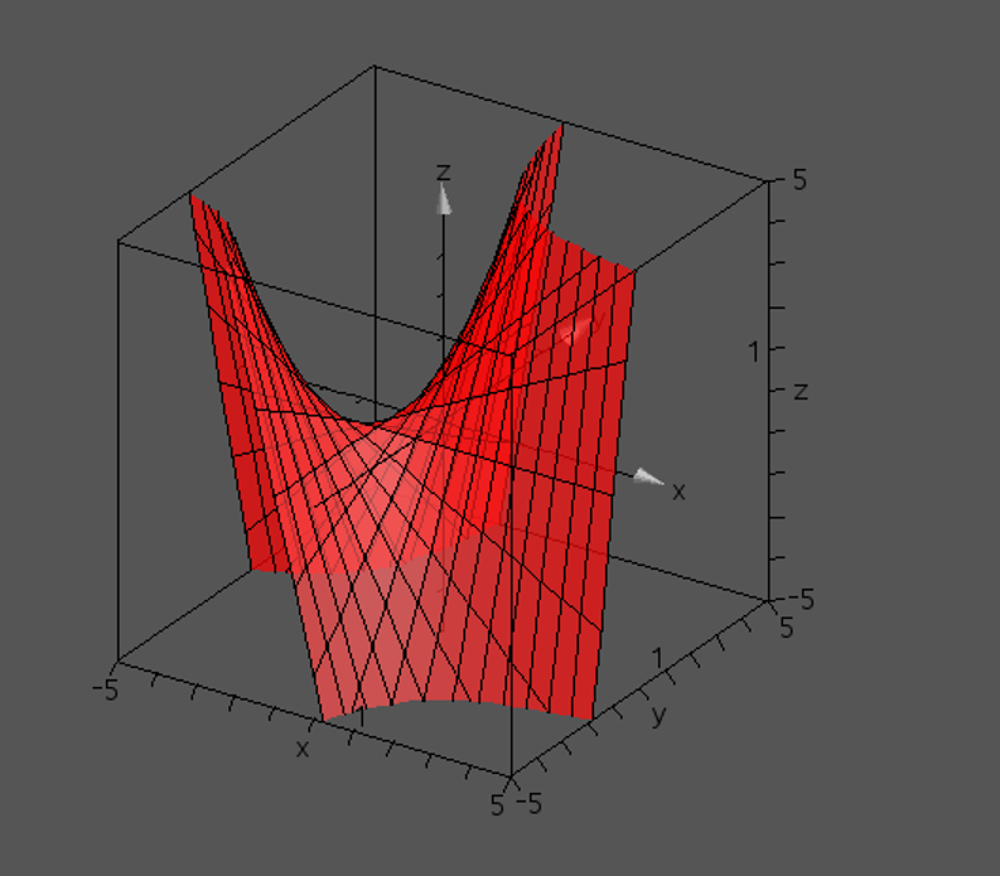

No, the tensor product of 2 linear functions is not necessarily a flat surface. For proof of this, consider the functions $f(x) = x, g(y) = y$. The tensor product of these functions is 
$$(1+x) \cdot (1+y) = 1 \cdot (1+y) + x \cdot (1+y) = 1+x+y+xy$$

It is visually evident that this surface is not flat.  
The reason for this is the $+xy$ part of the parametric expression, which makes it so that while flat lines exist on the surface when fixing one of the parameters (x,y), paths resulting from change in both variables are nonlinear.