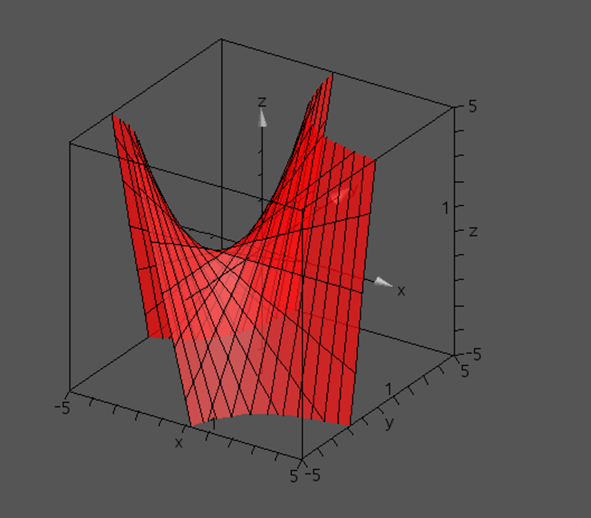

## Task 2
We define a curve as $p(t)$ with $p_i$ as Control points and $B_i^n(t)$ as a set of basis functions.


 $$p(t)=\sum_{i=0}^n p_i B_i^n(t)$$

 If we apply an affine transformation $T$

 $$T(p(t))=T\left(\sum_{i=0}^n p_i B_i^n(t)\right)$$

 we can use the linearity property of affine combinations

 $$=\sum_{i=0}^n T(p_i) B_i^n(t)$$


 which is again an affine combination of transformed control points $T(p_i)$. As the weights still sum up to 1 (Partition of unity), the curve is invariant under affine transformations.

## Task 3
The order in which the casteljau algorithm is evaluated does matter for the performance of getting the desired point.

Casteljau can be defined by the following pseudocode:
```python
def deCasteljau(points, t):
    n = len(points) - 1
    b = points.copy()
    for step in range(n):
        for i in range(n - step):
            b[i] = (1 - t) \cdot b[i] + t \cdot b[i + 1]
    return b[0]
```
As can be seen, for every iteration of the outer loop, 2 multiplications and one addition is performed for every point in the inner loop. The outer loop is run `n=length(points)-1` times. Thus, in total
$n\cdot(n-0)\cdot(n-1)\cdot(n-2)\dots = \frac{n\cdot(n-1)}{2}$ additions and $2 \cdot \frac{n\cdot(n-1)}{2}$ multiplications are performed in one execution of deCasteljau. This is both $O(n^2)$.

When faced with a grid of dimensions $n \times m$, a point can be computed by choosing a first axis $a$ and a second axis $b$. Then, deCasteljau needs to be computed $a$ times on a curve of $b$ points first, and then deCasteljau is computed once again on the $a$ resulting control points. In total,
$a \cdot \frac{b\cdot(b-1)}{2} + \frac{a\cdot(a-1)}{2}$ additions and $2 \cdot (a \cdot \frac{b\cdot(b-1)}{2} + \frac{a\cdot(a-1)}{2})$ multiplications are performed in this process.

As can be seen, the deCasteljau algorithm gets executed more often on points on the $b$ axis. It is thus adviseable to choose the $b$ axis as the axis with less points when using a non-square control grid.

Additionally, since the final step of the deCasteljau algorithm can be used to compute a normal value, if only the normal value in one dimension is to be computed, the algorithm should be used so that axis is chosen as $a$.

## Task 4
No, the tensor product of 2 linear functions is not necessarily a flat surface. For proof of this, consider the functions $f(x) = x+1, g(y) = y+1$. The tensor product of these functions is 
$$(1+x) \cdot (1+y) = 1 \cdot (1+y) + x \cdot (1+y) = 1+x+y+xy$$


It is visually evident that this surface is not flat.  
The reason for this is the $+xy$ part of the parametric expression, which makes it so that while flat lines exist on the surface when fixing one of the parameters (x,y), paths resulting from change in both variables are nonlinear.

## Task 5
Lets assume that there is a set of points: P = { (0,0), (1,1), (2,0) } which is a triangular shape.
In the local polynomial approximation, it constructs a polynomial around each point’s neghborhood and obatin the tangent at that point. Therefore, for the above case, the tangents at (0,0) and other points will be a straight line. 
However, the MLS surface is obatined by smoothly interpolating the given points. So, it will approximate the points with a parabolic shape.
As a result, the tangents of the local polynomial approximation will be straight lines, while the tangents of the MLS surface will be curved. Like this example, the tangents of the local polynomial are not necessarily the tangents of the MLS surface.
